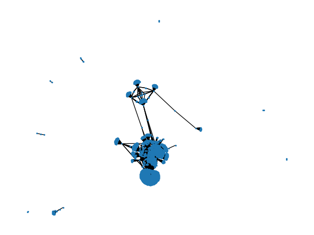

# SECScraper
Scrape financial data from large corps

Functions work with the SEC EDGAR database to scrape financial data from large corporations.
I guess the functions should be used with something like Jupyter or whatnot, but I personally just used a bunch of other misc. scripts, alongside changing this script a lot, to get stuff. A lot of paths are hardcoded for simplicity, using the directory SECData/year

### 2008 financial graph:

The above graph shows the connectedness of everything. It's a bit of a mess, but it's a good representation of the data.